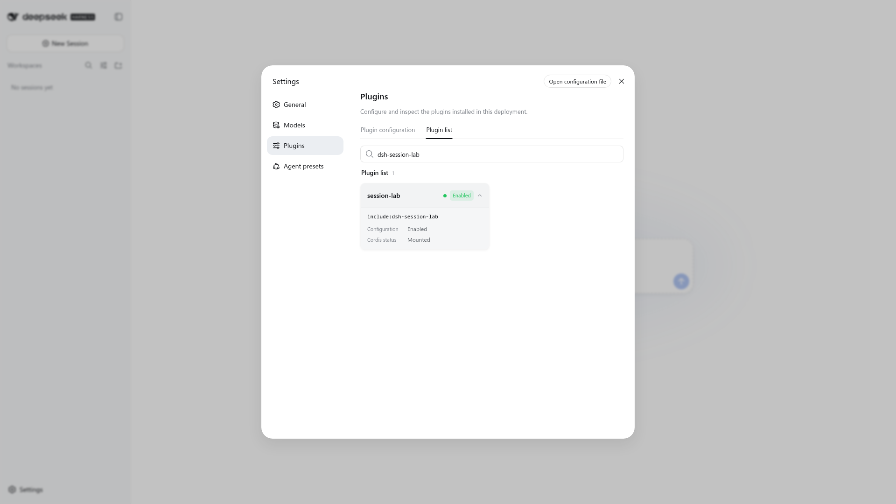

# DSH Session Lab

[English](README.md) | 中文

DSH Session Lab 是一个独立的 DeepSeek Harness（DSH）社区插件包，用于把一次成功的 Agent 会话转化为可分享的证据、可评测的 Skill 和可对比的受控实验。

> 本项目是独立的 pre-1.0 社区插件包，不是 DeepSeek 官方产品，也不代表 DeepSeek 立场。

## 三个工作 Skill

| 你要做什么 | 使用 | 产出 |
| --- | --- | --- |
| 分享或归档一次会话 | [`dsh-capsule`](dsh-capsule/SKILL.md) | 已脱敏、带完整性校验的 `.dshc` 证据包 |
| 把成功会话沉淀成可复用工作流 | [`dsh-teach`](dsh-teach/SKILL.md) | 候选 Skill、独立 baseline/treatment 评测报告 |
| 理解两次运行为什么不同 | [`dsh-time-machine`](dsh-time-machine/SKILL.md) | 基于共同切点的轨迹比较和因果限制说明 |

## 30 秒开始

环境要求：Node.js 22.19+ （或 24+）用于 DSH 和插件安装，Python 3.10+ 用于 Skill 辅助脚本。

在已有 DSH profile 中从 GitHub 安装：

```bash
dsh plugin --profile web add github:zhangguiping-xydt/dsh-session-lab
```

要固定到已审阅的版本：

```bash
dsh plugin --profile web add github:zhangguiping-xydt/dsh-session-lab#v0.1.0
```

如果没有全局 `dsh` 命令：

```bash
npx --yes @deepseek-ai/dsh@latest plugin --profile web add \
  github:zhangguiping-xydt/dsh-session-lab
```

安装后重启 DSH profile。可用下面的命令检查插件层是否加载：

```bash
dsh --profile web --dump-config | rg '# == dsh-session-lab'
```

在 DSH Web UI 的“Settings → Plugins → Plugin list”中，也可以搜索并确认 `session-lab` 已显示为 Mounted、Enabled：



然后在会话中明确调用：

```text
Use $dsh-capsule to package and verify this DSH export.
Use $dsh-teach to extract and independently evaluate a Skill from this successful session.
Use $dsh-time-machine to compare these two sessions from their common completed turn.
```

## 使用时要知道的事

- `dsh-capsule` 只处理你明确提供的 DSH `/export` 文件，不会读取 `$DSH_HOME/sessions` 中的内部压缩存储。
- 原始导出、补丁、图片和报告可能含有敏感内容；模式替换不等于完整匿名化。
- 不要把文件路径、账号、Session ID、内部地址、Token 或 API Key 发到公开仓库。
- `dsh-time-machine` 的会话 fork 不会自动隔离工作区；两条轨迹应使用独立副本或 worktree。
- “会话完成”不代表业务结果正确；评测必须有会话外的测试或明确人工判据。

## 评测示例

仓库内提供了一个已脱敏的 `dsh-teach` 完整评测示例：6 个成对任务、共12次新会话：

```text
baseline 通过：1/6
treatment 通过：6/6
安全失败：0
误触：0
路由遗漏：0
```

这是固定样例的回归证据，不是对所有项目和模型的保证。请阅读[完整报告](examples/dsh-teach-full-eval/eval/report.md) 和[评测协议](dsh-teach/references/evaluation-protocol.md)。

## 本地开发与验证

```bash
npm ci
python3 -m pip install -r requirements-dev.txt
npm run verify
npm run test:eval
npm run lint:package
npm pack --dry-run
```

## 发布与参与

```bash
mkdir -p dist
npm pack --pack-destination dist
dsh plugin --profile headless add ./dist/dsh-session-lab-0.1.0.tgz
```

本项目使用 MIT 许可证。插件市场与社区收录不会因为你是否发布 npm 而改变 GitHub 安装方式。

- [源代码仓库](https://github.com/zhangguiping-xydt/dsh-session-lab)
- [Awesome DSH Plugin 社区收录](https://github.com/awesome-dsh-plugin/awesome-dsh-plugin)
- [DeepSeek Harness Discussions](https://github.com/deepseek-ai/deepseek-harness/discussions)
- [DeepSeek Harness Discord](https://discord.gg/Ycq5dCaS4)

## 安全声明

安装 DSH 插件会在本机权限范围内运行第三方代码。安装前请审阅源码，并在不含有敏凭据的可丢弃环境中试用。详细说明见 [`SECURITY.md`](SECURITY.md)。
